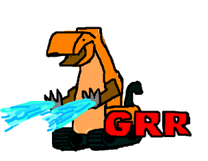
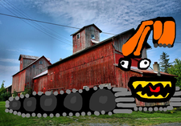

GRR
===

[](https://travis-ci.org/trailofbits/grr)
[](https://empireslacking.herokuapp.com/)



GRR is an x86 to amd64 binary translator. GRR was created to emulate and fuzzer DECREE challenge binaries.

#### Features

  * Code cache persistence (avoids translation overheads across separate runs).
  * Optimization of the code cache, including the persisted cache.
  * Multi-processing support (allows multiple communicating, 32-bit processes to be emulated within a single 64-bit address space).
  * Built-in fuzzing engine, which includes Radamsa.
  * Support for self-modifying code (e.g. JIT compilers). Self-modified code can also be persisted.

#### Anti-features

  * Orchestration. GRR does not manage a fuzzing campaign. An external orchestration system can direct GRR to fuzz a program, and identify a minimal set of maximal coverage-producing inputs.

### Compiling

#### Debug Build
```sh
make clean all
```

#### Release Build
```sh
make clean all GRANARY_TARGET=release
```

### Running

There are two steps to running GRR: snapshotting, and record/replaying. Snapshotting creates an initial image of the binary after `execve`. Record/replaying takes an input testcase and attempts to replay that testcase. The replay can be recorded or mutated as well.

#### Snapshotting

You can run `grrshot` on a CGC challenge binary, or on a statically linked 32-bit ELF version of a CGC challenge binary.

```sh
./bin/debug_linux_user/grrshot --num_exe=1 --exe_dir=/path --exe_prefix=CADET_000 --snapshot_dir=/tmp/snapshot
```
This will create a snapshot of `/path/CADET_00001` and store the snapshot into the `/tmp/snapshot` directory.

#### Replaying
```sh
./bin/debug_linux_user/grrplay --num_exe=1 --snapshot_dir=/tmp/snapshot --persist_dir=/tmp/persist --input=/path/to/testcase 
```

#### Replay + Recording
```sh
./bin/debug_linux_user/grrplay --num_exe=1 --snapshot_dir=/tmp/snapshot --persist_dir=/tmp/persist --input=/path/to/testcase --output_dir=/tmp/out 
```

#### Replay + Recording + Mutating
```sh
./bin/debug_linux_user/grrplay --num_exe=1 --snapshot_dir=/tmp/snapshot --persist_dir=/tmp/persist --input=/path/to/testcase --output_dir=/tmp/out --input_mutator=inf_radamsa_spliced
```

There are many mutators. Some of the mutators are deterministic, and therefore run for a period of time that is proportional to the number of `receive` system calls in the input testcase. Other mutators are non-deterministic and can run forever. These mutators are prefixed with `inf_`.


### Dependencies

#### System dependcies
```
sudo apt-get install -y git build-essential
sudo apt-get install -y clang-3.8 clang++-3.8 llvm-3.8-dev libc++1 libc++-dev
sudo apt-get install -y libgflags-dev
```

#### Intel XED

GRR depends on the [Intel XED](https://software.intel.com/en-us/articles/xed-x86-encoder-decoder-software-library) instruction encoder/decoder. A copy of XED is bundled within this repository. XED is licensed under the [What if pre-release license](third_party/xed-intel64/LICENSE.txt).

#### Radamsa

GRR depends on [Radamsa](https://github.com/aoh/radamsa), a high-quality input mutation engine. GRR embeds a version of Radamsa that can be used as a kind of library. Radamsa is licensed under the [MIT license](third_party/radamsa/LICENSE).

#### Other dependencies

GRR depends on [gflags](https://github.com/gflags/gflags).

GRR depends on Frank Thilo's C++ port of the the RSA Data Security, Inc. MD5 Message-Digest Algorithm.

GRR uses Yann Collet's [xxHash](https://github.com/Cyan4973/xxHash) as part of its code cache index hash table.

### History

GRR, short for Granary Record/Replay, is the third iteration of the [Granary](https://github.com/Granary) series of dynamic binary translators. GRR is [pgoodman](https://github.com/pgoodman)'s third dynamic binary translator.

GRR was created for the DARPA Cyber Grand Challenge. It was an essential component of Trail of Bit's CRS. The version of GRR in this repository differs from the CRS version in some important ways.


